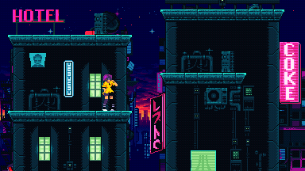
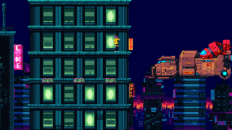

# Tau Ceti

[](https://ci.appveyor.com/project/mupfelofen-de/tauceti)

## About

Tau Ceti will be a cross-platform 2D sci-fi platformer game written in C
using SDL2 and [eszFW](https://github.com/mupfelofen-de/eszFW): a
cross-platform game development framework written in C.

[](.media/01.png?raw=true "01")
[](.media/01.png?raw=true "02")

## Android version

An Android version is available on Google Play:

[](https://play.google.com/store/apps/details?id=de.mupfelofen.TauCeti)

## Controls

To play the game using the touch screen, simply hold your finger in the
direction you want to go.  To jump, swipe your finger up and to crouch,
hold your finger on the bottom of the screen.

```
F:       toggle fullscreen
Q:       quit
SPACE:   jump
LEFT:    walk left
RIGHT:   walk right
DOWN:    crouch
```

## Compiling

To compile _TauCeti_ under Linux simply enter:
```
git clone --recurse-submodules -j2 https://github.com/mupfelofen-de/TauCeti.git
cd TauCeti
mkdir build
cmake ..
make
```

If it doesn't work, you can also use a plain make instead:
```
make
```

If you're on NixOS enter:
```
nix-shell --command make
```

## Licence and Credits

This project is licenced under the "THE BEER-WARE LICENCE".  See the
file [LICENCE.md](LICENCE.md) for details.

[Warped City](https://ansimuz.itch.io/warped-city) by Luis Zuno
(@ansimuz).  Licenced under a [CC-BY-3.0
Licence](http://creativecommons.org/licenses/by/3.0/).

Every other work is dedicated to [public
domain](https://creativecommons.org/publicdomain/zero/1.0/).
